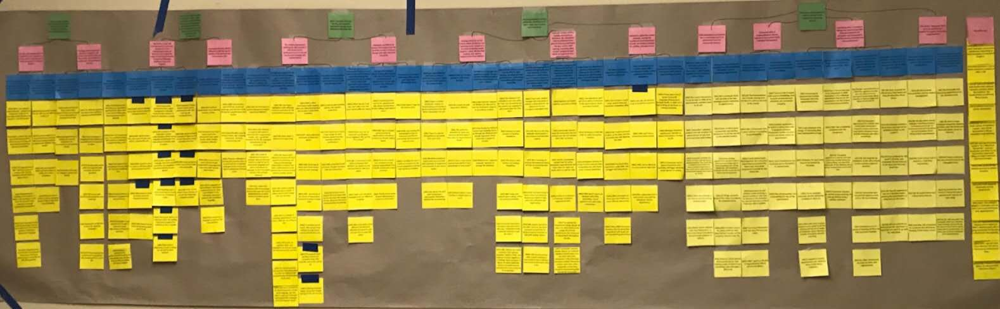
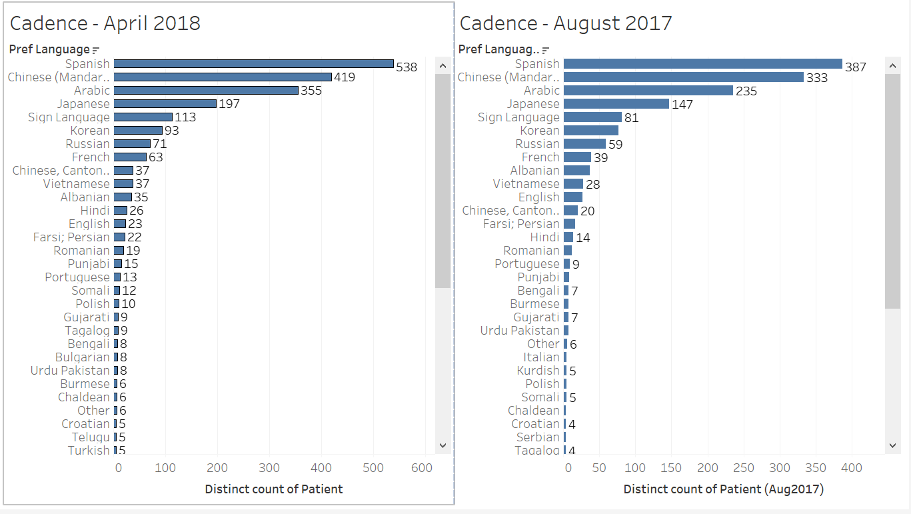

[Back to Homepage](../index.html)

# Executive Summary
Michigan medicine assigns translators to ESL patients seeking medical support. The director of Interpreter Services needs to organize and analyze the translation request data provided by the hospital to understand how many translators need to be hired for each language. 

Team STATA-Sphere used qualitative research process to uncover the workflow behind the inefficient data manipulation process. We gathered data through conducting observations and in-depth interviews with the director, assistant, database management team leader and interpreter who are involved in data management for the translators service. After the interview process, Team STATA-Sphere analyzed and outlined the findings of each interview and mapped the common themes using the affinity wall method in order to discover higher level insights. 

Finding and Insights: 

* The data managed by the interpreter service comes from various sources due to the involvement of different organizations within Michigan Medicine and vender companies. 
* The data which Interpreter Services analyzes is split across a variety of platforms due to the use of different vendors for various hospital services. 
* Due to the complex data sources, multitude of platforms, and underuse of tools, the data manipulation process is arduous and inefficient.
* Accurate data representation is essential to better inform leadership to make decisions about general management and staff level in order to sort out and improve the current issues in data management.
* There are procedures and problems of different groups in the interpreter scheduling process.
Potential solutions must fit within the restrictions of a tight budget and complex legal framework.

Three recommendation is made to improve the efficiency of the data workflow:

* Take Advantage of the Tableau license through Michigan Health
* Utilize the Interpreter Module Built in the Current Platform 
* Cooperate with UMSI for Class Projects

# Client Introduction
The Interpreter Services Center in Michigan Medicine, one of the largest academic medical centers in Michigan, is responsible for providing medical interpreting and translation services for limited English proficient, deaf, blind, and hard of hearing patients and families as well as a training center for interpreters. Their mission is to educate patients that they have the right to seek help in language assistance and complex medical documents. 

Right now, the Interpreter Services Center has over one hundred interpreters providing services of seventy different languages. Their services include providing in-person interpreters and telephone interpreting in all languages. Interpreter Services also works to provide medical documents in native languages and translations of records from foreign countries while also addressing the effect of culture and language on delivery of health services in the University of Michigan Health System

Our client also deals with federal regulations that require medical facilities to provide language services for individuals with limited English proficiency (LEP). Those regulations have their root in the 1964 Title VI of the Civil Rights Act on the basis of not designating based on country origin. The new 2016 Patient Protection and Affordable Care Act section 1557 specified standards for qualified interpreter serving in medical settings. A variety of forms that implement these rulings occurs in different circumstances concerning technology, cost and language availability. This played a role in devising a solution for our client. 

# Problems

The Interpreter Services Center has a large amount of data collected from a multitude of medical tools about the in-house interpreters and telephone interpreting providers. Because the data comes from many different vendors, it is hard to format the data in a unified form or combine those sources of data together. Therefore, the methods of processing and analyzing data by the Interpreter Services Center are extremely inefficient. These methods entail hand-counting and pure memorization to identify what languages are currently being translated within the health system. 

With an overly complex data stream, they are also unsure of what data is useful and should be collected to help them make decisions such as hiring and staffing interpreters. In addition, the Interpreter Services Center is also facing issues around the scheduling of appointments since clinics does not always use the scheduling tools for interpreters in a desirable way. Interpreter Services desires a way to improve the time spent each week on cleaning and collating the data so that the director can focus on interpreting the data to inform staffing levels, determine the needs for translated medical materials for Title VI compliance for various languages within the Michigan Health System, and to build tools to generate conclusions and visualizations for a yearly report. It is imperative for Interpreter Services to receive solutions that can be implemented quickly as the accurate measurement and tracking of patient data and interpreter usage is necessary to meet federal regulations for Title VI and the medical system is due for another audit in the near future. 

# Methodological Overview
To gain insight into the problem that Interpreter Services faced, our team wanted to emphasize a human-centered approach when designing a solution. We utilized contextual inquiry--a process of interviewing a user in their place of work to better understand how they interact with their environment and data flow. Through a series of interpretation sessions with individuals who function throughout Interpreter Services and its vendors, the gathered data was analyzed to determine the key trends and themes that the Interpreter Services are facing. Quotes from the interview and key statements created from interpretation sessions were then organized into a hierarchical map of information, called an affinity diagram. We concluded our process by utilizing the data and analysis to engineer a solution for our client. 

Our client provided us with a list of potential interviewees: two managers, a scheduler, and an interpreter. As we conducted the interviews, we identified two additional key interviewees from the data provider companies that Interpreter Service utilized. We asked data managers about the context of the data and what the ideal end-goal would be. Data analysts were able to provide us with the information they collected across their reports and what roadblocks existed in that process. The additional interviewees were data engineers that described their current capability in collected and returning data and if the data could be returned in a more user-specified request. By interviewing groups from different areas, we were able to come up with recommendations that took into account the unique perspectives at Interpreter Services.

With the conclusion of the interviews, our team analyzed the data collected from the interviews by holding a series of interpretation sessions. We talked through the interviews and created over 200 key statements, documented on sticky notes. With these findings, we created an affinity wall, which is a qualitative data centered approach to determining overarching themes and trends. By clustering the sticky notes, we were able to draw connections between the individual statements and summarize major insights that would eventually help us in our recommendation of solutions.  

# Findings
## Interpreter Services Collects Data from a Variety of Sources
The data managed by the Interpreter Services comes from various sources due to the involvement of different organizations within the Michigan Medicine and vender companies. Data comes in different formats and is generated during the process of patients making appointments for the interpreter services or when receiving the interpreter services. Data from these sources may contain confusing and abundant information that are unrelated to the the interpreter service which may cause inconveniences in data cleaning. Below are the different sources where the data comes from:

Patients may schedule interpreter services in-person or through two phone lines depending on their needs. For the in-person scheduling, information would be entered and transferred through the Cadence system, which is an overarching data platform for clinical information within the Michigan Medicine system. Cadence is mainly in charge of patient scheduling and front desk data tracking. ICU and DIAL are two systems that provide phone services for scheduling interpreter services for patients who are not on site at the hospital. 
Related to the Interpreter Service, DIAL phone lines only schedule interpreter services for patients, while ICU phone lines not only provide scheduling services for interpretation scheduling but also provide other services such as billing inquiry. However, when data was transferred to the Interpreter Service, a relatively large amount of unrelated information about billing or scheduling for other services would be passed to the management team regardless which results in extra effort to sort out the data.

The Interpreter Service systems provide both in-person and phone interpretation services. The in-person interpretation service is provided by the interpreter team from the Interpreter Services, and the phone services is provided by a vender company names the Pacific Interpreters, which provides a various language interpretation services on phone for Michigan Medicine. Data such as the language, interpreter’s name, appointment starting time, which concerns the service itself would be logged by the clinics where the doctor’s appointment happened through the Cadence system (in-person services for outpatients, inpatient, ED, and OR), and by the Pacific phone services. Clinics, through Cadence, only provide the name of the interpreter that is assigned and the language of the services. For the data from Pacific, billing information, and phone sections log information from other services were also included and mixed in the service log data that is provided by Pacific. 

Due to the mixed formatted and confusing data from multiple providers, the data management needs to go through each piece of the information to decide on which information are relevant based on her own familiarity about the interpreter and the time frames of the schedule, which leads to the arduous process of handling the incoming data. Our team discovered that the team cleaning the data often relied on memorization of interpreter names to identify cells or rows containing pertinent information.

## Data Displayed with the Multitude of Tools
The data which Interpreter Services analyzes is split across a variety of platforms due to the use of different vendors for various hospital services. There are multiple platforms that are used to display and store data, while these existing tools may not be utilized properly and sometimes causes confusions. The platform includes MiChart, Mbox, Provider Message, email and paper printouts.

MiChart is a overarching data platform that is used by multiple Michigan Medicine data system, such as Epicare (Ambulatory), ASAP (Emergency Department), Resolute (Hospital Billing), Cadence (Patient Scheduling and Front Desk)(Michigan Medicine, 2018). All data that is from Cadence would be logged and transfer through MiChart. 

Some information that from clinics will go directly through a system named called Provider Massage, which is a channel for clinical information communication. U-M Box is Michigan's implementation of the Box.com cloud storage and collaboration service(University of Michigan, 2018). The manager and assistant in Interpreter Service use U-M Box to store and transfer data on a smaller scale. Email and paper printouts are tools for the same purpose.

There is some functionality that is not utilized well in MiChart. For example, a staff member in Interpreter Service was not aware of the different format that MiChart can export. Staffs both from MiChart and the Interpreter Service were aware that there is an existing module but unused module for interpreters to track their service appointment and log information. The implementation of this module requires leadership’s decision from a higher level.

## There is Inefficiency and Manual Labor Involved in the Data Manipulation Process
Due to the complex data sources, multitude of platforms, and underuse of existing tools, the data manipulation process is arduous and inefficient. The general process of the data manipulation process includes downloading reports from different vendors, opening .csvs and copying relevant information to a new worksheet in Excel, hand counting interpreter appointments, recognizing interpreter names by memory, and compiling the results into another Excel file for tracking monthly totals. The final Excel sheets for each month are stored in folder trees within U-M Box. At the end of a given year, the monthly reports are compiled together into a new Excel sheet to track data across a full year, though this process encounters errors in spreadsheet functionality between downloads and uploads in U-M Box.

More specifically, the preparation work for processing data for ER, OR and inpatient entails filtering, ordering, and breaking up data in MiChart. For example, a staff member needs to alphabetize the data by provider resource because there is no way for her to know what language each row is and she only knows the language of each interpreter (listed in the provider resource). She marks lines between different language sections (because the form is alphabetized by provider resources) to break up the data.

Manipulating data of the interpreter service involves lots of inefficient and time-consuming manual work. Also, outdated and difficult to process information from the providers results in incorrect demographic data and takes time to fix. For example, data from the Pacific is easier to work with because it is in the .csv format, but to sort out which entries are related to actual interpreter services, a staff member has to compare phone records for appointments with Pacific’s billing report, which takes eight hours per weekend. And these arduous processes of cleaning the data results in bias from human performance errors. 

Attempts to help automate this process in the past through Excel macros were attempted but the macros were found to break or produce erroneous counts and totals. The director also faces challenges training other staff members in the process as certain steps require a deep understanding of Excel functions and pivot tables. While the director has attempted to train interpreters and office workers to assist in the data cleaning process, staff turnover and the complexity of the task have left the director and her assistant as the primary leads of data cleaning and analysis in the office. Interns were tried but were found to have lacking skills in Excel and the results from interns were often unreliable.

## Documentation and Data Collection is Inaccurate Unless the Data is Properly Processed

Interpreter Services also face challenges gathering the most up-to-date demographic data. Currently, the interpreter services use community demographics from U.S. Census in 2010 to describe the community that interpreter services serve. When taking into account that around 55 million people in the United States speak a language other than English, that is about 1 in 5 Americans. 24 million Americans are limited english proficiency, which is about 9% of the population(Flores et al., 2008). It is a small, but significant number. If Interpreter Services is utilizing U.S. Census data and not getting access to the correct demographic data that interpreters and clinics should be inputting--they are submitting incorrect proposals for future development, such as staffing levels and translated medical literature. Interpreter Services are key to getting patients adequate health care, but without proper documentation of data, they run the risk of inaccurate reporting. 

Accurate data representation is essential to better inform leadership to make decisions about general management and staff level in order to sort out and improve the current issues in data management. Directed evidence and quantitative research try to prove that the more data-driven a company strategy making is, the more productive it is. More refined data collecting methods and data contents are required. With the current data collecting system, a relatively large amount of unrelated information are transferred to the Interpreter Services management team and some important pieces of information are not collected to properly support the data handling procedure and to inform the decision making procedure. For example, to get the accurate number of clinics and hospitals that used a phone for interpretation, an assistant has to manually compare phone records for appoints to the billing statement of Pacific. This is a cumbersome process that leads to inaccuracies in counting the number of interpreters that should be hired for a specific language. 

Ideally, a cleaner data file with only the appropriate information is expected from each data providers in the future. Our team also discovered that there is an unused interpreter module for documenting and tracking in EpiCare Ambulatory that interpreters can use, but such module needs the approval from a higher leadership. Within the MiChart system, if more thoughtful and thorough work documentation can be provided by Epicare, individual interpreters, and clinics, it would potentially be helpful to the current data processing situation and ensure that the correct demographic data is collected and stored. 

## Scheduling is Cumbersome Due to Issues with How Data is Entered into the System
There are procedures and problems of different groups in the interpreter scheduling process. The scheduling procedures for interpreters has been an issue of the general efficiency of the system, involving pragmatics such as how different clinic utilizes the interpreter services and how interpreters schedule their shift. This is a bigger systematic issue that cannot be solved in a short time. Clinic procedures and policies are continuing source of scheduling issues for Interpreter Services since there is a wide variation in how clinics utilize the scheduling tools for interpreters and scheduling error often occurs resulting in a delay of the services in some cases. Clinics given the proper training are able to better enter information on interpreters during appointments, but even then, the response rate for clinics to respond to reports on patients served was 7%. 

Also, Interpreters’ times are underutilized by factors outside of the control of the individual interpreters such as rescheduling and commuting. Almost 50% of interpreter time is spent waiting and traveling to appointments, causing inefficiency in getting patients the right access to an interpreter. Rescheduling happens frequently in the hospital system, which wastes a lot of money, but this is an issue that resides with both the patients and the interpreters. Patients tend to reschedule right before an appointment, causing interpreters to have to move around their schedules to accommodate the patients. However, the schedulers at Interpreter Services have a clear methodology to assigning appointments, since each scheduler is in charge of their own interpretation groups. Scheduling done in-house at Interpreter Services has well-defined processes for schedulers and interpreters, but the current methods may need refinement.

## The Solution Should Be Inexpensive Due to Limited Sources

Potential solutions must fit within the restrictions of a tight budget and complex legal framework. Although Interpreter Service tried to solve the data management problem by hiring part-time students, training interpreters, and teaching class to relative employee to manipulate the dataset, due the overly complex data processing procedure, hiring staff who are not already familiar with dataset or without more professional data science background is not an ideal solution to the problem. As the client stated, "hiring people right now is not okay”, we took into account that the current budget cannot afford the interpreter services to hire data scientists or software developer who can automate the data processing procedure.

Some systematic changes, such as the scheduling system of how interpreters such as redesigning the on-call mechanism, and more efficient interpreter assignment can be a future direction for, meeting the demands and improving the services in general. Interpreter services may attempt to increase use of video interpreting while keeping fewer in-person interpreters with a fuller schedule in the future.

# Recommendations
After collecting the data from the interviews and analyzing the results with the client needs in mind, our team came up with the following three solutions that would help ease time spent on data analysis while fitting in the tight budget restrictions of Interpreter Services:

## Take Advantage of the Tableau License Through Michigan Health
Tableau is a powerful tool that can help address with the tedium of importing csv format files with different layouts. Using Tableau for data processing may increase the speed of data wrangling that is currently done through enormous amounts of copy and paste methods and hand counting. According to Cadence employees interviewed, licenses are available from IT upon request and training sessions about Tableau are offered regularly within the Michigan Medicine system(Gottschalk, 2018).

There is evidence that Tableau has already been effectively implemented in other departments within Michigan Medicine. According to the Tableau website, workers in charge of creating billing estimates were spending enormous amounts of time coding or hiring outside developers to complete the work and would often find that solutions were inefficient or incorrect. After the creation of the Fast Analytics team, dashboards were created within Tableau that produced results that formerly took four or more hours to complete in seconds (Tableau Software, 2018). 

STATA-Sphere believes that a dashboard could be created that allows users to import the .csv files from Cadence other sources and quickly gain insights and diagrams for use in measuring staffing needs, language counts, and interpreter appointments. Tableau is able to connect with MIBox to easily import worksheets into the platform. In addition, the dashboards avoid the necessity of a deep understanding of Microsoft Excel syntax so that relatively inexperienced users can still interpret and understand data without running into pitfalls. 

Therefore, if implemented properly, Tableau is a decent and also economic solution that fits the tight budget since Michigan Health already has the access to the Tableau license, and there are also many high-quality training resources available both online and within the Michigan Medicine health system.

## Utilize the Interpreter Module Built in the Current Platform
The Interpreter Module in MiChart is another feature that is not currently used but can be utilized for improvement. It allows interpreters to enter relevant information into MiChart after their appointment, helps standardize the tracking of appointments fulfilled by in-person interpreters, and allows for cleaner customized reports to be built within the Cadence framework that make exporting of key data easily possible. Through communication with the teams working on MiChart, custom reports generated from within the interpreter module framework can ease the data cleaning required before data analysis and visualization begin. Our team was drawn to this solution due to the lack of cost and potential for quick and easy implementation. It is our team’s belief that the approval and access to this module’s use from higher ups can be easily justified as a critical need to maintain compliance for Title VI of the Civil Right Act (1964). 

As a side benefit, this data tracking in the Interpreter Module puts the data entry work in the hands of interpreters, which allows for the Director of Interpreter Services to easily manage and adjust as needed without needing to navigate the data input process for individual clinics. One of the problems faced by Interpreter Services was gathering correct data from appointments. With the implementation of this model, Interpreter Services would now to able to capture more accurate demographic, scheduling, and patient data. 

## Cooperate with UMSI for Class Projects
The most ideal solution is to hire a data scientist or student intern in the data track to build scripts that scrape .csv files for pertinent information. There already exists a Visual Basic Application that a student had previously created for the client. A data scientist or student intern with a background in programming would be able to modify the existing VBA and help the client with her issue. Hiring someone with that skill set would not only fix the programming part of the problem, but they would be able to help the client find interesting, previously unknown, patterns in the data.  

However, considering the budget constraint the Interpreter Services Center is facing, we suggest the center cooperate with UMSI and seek for opportunities, for example, infoLab, to have student groups step in and solve the technical problem. According to the team members in STATA-sphere who joined infoLab this semester, infoLab includes students majoring in data science, not just design students in the former years. The Interpreter Services Center can talk to the staff that leads the infoLab next semester to set up a project focusing on the cleaning and organizing of data collected by Interpreter Services. This is a win-win game for students to gain valuable experiences within the field of data analysis and manipulation to list on their resume while also providing a cost neutral solution for Interpreter services.

In addition to the infoLab, the Interpreter Service Center can also connect with the student organization at UMSI called A2 Data Dive. A2 Data Dive brings together UMSI students who specialize in data science to volunteer to help organizations in data organization, manipulation and visualization. In this way, students can bring technical support to the interpreter service.

# Conclusion
With the implementation of contextual-inquiry knowledge, interviews with a multitude of people from Interpreter Services, and various interpretation sessions, we were able to gain insight into the data problem that Interpreter Services faced. Our team determined that the inefficiency of manipulating data in the Interpreter Services Center was mainly due to the variety of sources and the visualization by a multitude of tools--resulting in a negative effect while documenting and collecting data. However, Interpreter Services Center can implement outside tools or utilize the modules built in the current platform, such as Cadence. Therefore, to have a more accurate data representation for the leadership board to make decisions about general management and staffing levels within Interpreter Services, the STATA-Sphere team came up with the three potential solutions. 

The three solutions that Team STATA-sphere settled on were the following: to take advantage of the availability of a free Tableau license within the Michigan Medicine IT system, adding the use of the Interpreter Module in Cadence and accessing the custom reports that can be built within it, and lastly to take advantage of the additional opportunities to cooperate with University of Michigan students to create quality data management solutions. 

We believe that these solutions can help the Interpreter Services Center alleviate the untenable amount of time spent each week on data cleaning and processing by staff within the Interpreter Services office, help inform current usage of Interpreter Services throughout the Michigan Medicine system, and direct administrators in how to improve and sustain interpretation services to the clinics and patients throughout the Michigan Medicine system.

# References

Brynjolfsson, E., Hitt, L. M., & Kim, H. H. (2011). Strength in Numbers: How Does Data-Driven Decision Making Affect Firm Performance? SSRN Electronic Journal. 

Flores, G., Torres, S., Holmes, L. J., Salas-Lopez, D., Youdelman, M. K., & Tomany-Korman, S. 
C. (2008). Access to Hospital Interpreter Services for Limited English Proficient Patients 
in New Jersey: A Statewide Evaluation. Journal of Health Care for the Poor and 
Underserved, 19(2), 391–415. https://doi.org/10.1353/hpu.0.0007

Gottschalk, A. (2018, September 11). ITS Information Quest hosts premier Tableau Symposium 
– Michigan IT News. Retrieved December 9, 2018, from https://michigan.it.umich.edu/news/2018/09/11/premier-tableau-symposium/

Interpreter Services. (2018). UMHS Interpreter Services Home. Retrieved December 9, 2018, 
from http://www.med.umich.edu/interpreter/index.html

Michigan Medicine. (2018). EMR Training & User Materials. Retrieved December 9, 2018, from 
https://medicine.umich.edu/dept/office-clinical-informatics/emr-training-user-materials

Provost, F., & Fawcett, T.  (2013, March). Data Science and its Relationship to Big Data and Data-Driven Decision Making. Big Data, 1(1), 54.

Tableau Software. (2018). Michigan Medicine optimizes workforce with Tableau, saving 5,000 
analyst hours in a year. Retrieved December 9, 2018, from 
https://www.tableau.com/solutions/customer/university-michigan-health-center-processe
s-literally-thousands-hours-seconds

The Evolution of Decision Making: How Leading Organizations Are Developing a Data-Driven Culture. (2016, April 20). Harvard Business Review. 

University of Michigan. (2018). Box at U-M. Retrieved December 9, 2018, from 
https://its.umich.edu/communication/collaboration/box

[Back to Homepage](../index.html)

