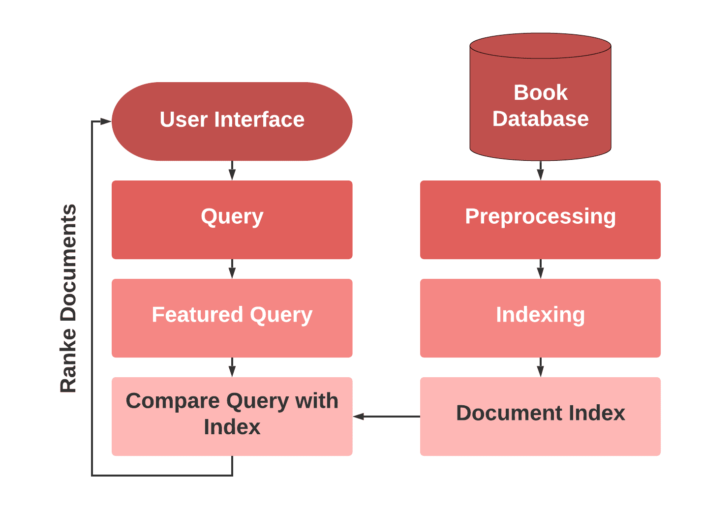
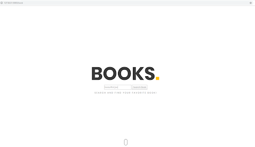
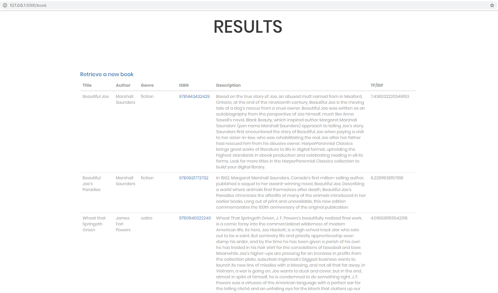
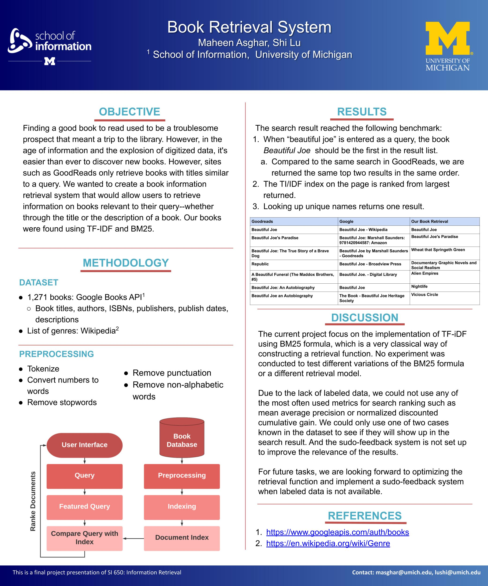

* masghar@umich.edu , lushi@umich.edu

* Instructor: Qiaozhu Mei

[Back to Homepage](../index.html)

# Abstract
Finding a good book to read used to be a troublesome prospect that meant a trip to the library. However, in the age of information and the explosion of digitized data, it's easier than ever to discover new books. However, sites such as GoodReads only retrieve books with titles like a query. In this research project, we propose a book information retrieval system that would allow users to retrieve information on books relevant to their query—whether through the title or the description of a book, with the use of the BM25 algorithm. After extracting book data from the Google API, preprocessing of the title and plot text, TF-IDF is used for ranking books by relevance. The most similar text is retrieved as an outcome of the book information retrieval system and results are evaluated by hand.

# Introduction
Information retrieval, in academic terms, is defined as finding material of an unstructured nature that statistics an information need from large collections [4]. With the advancement of technology, millions of people are engaging in information retrieval as they browse and filter document collections or process received documents. With the tremendous amount of information, people need efficient ways to sort out what kind of information was to be consumed. A search engine is often used to retrieve information. 

When looking for academic or technical material, people are task driven which means people clearly know the specific material they are looking for, which could be code, definition of a concept, or supporting material of an argument. When people are reading books, they are not looking for a specific line in a book, but a higher-level abstraction of the content. The search result should be attractive and relevant enough for the reader to spend a longer time with the materials. However, when searching about books with a general search engine, information of books with the different formats will show up, such as book lists, reviews of books, advertisements of books which makes it hard to browse the merely information of  books without distraction. A comprehensive and specialized database and a corresponding search engine for books is needed for such purpose so that users could browse the information of books for each their query. The current project aims to implement a search engine based on a book information database using the BM25 as the retrieval function. 

# Related Work

Deo et al. [1] proposed the process of information retrieval of a large collection of information resources through a cosine similarity function. The authors utilized the PSO algorithm, which is based on birds flocking, to optimize the population-based problem by iterative computation. They utilized a web crawler to full their corpus and indexed data by finding features through TF-IDF.

Kim et al [2] created a classification system that clustered research papers into a meaningful class in which papers were likely to have similar topics. The system extracted meaningful keywords from the abstracts of each paper using K-means clustering and applied Latent Dirichlet Allocation (LDA) and TF-IDF to classify the documents.
Term frequency normalisation parameter tuning could help improve retrieval performance and Ounis [3] proposing a new parameter tuning method by measuring the normalisation effect since the classical pivoted normalisation approach suffers from the collection-dependence problem. The new methods were tested on both Divergence From Randomness (DFR) models and the BM 25’s normalisation method.

# Method
## Dataset

Our data was composed of 1,271 different books, including two test cases inputted by ourselves, from the Google Books API, which returned results based on genre searches. This dataset included the book’s title, author, genre, ISBN, publisher, published date, and description. To gather genres to use with the API, we pulled a list from Wikipedia’s ‘List of genres‘ page, in total, 381 genres. However, due to the limitations of Google Books API, we were only able to find a little over a thousand books. This data was stored into a google cache and then transferred into a SQLite database.

## Preprocessing
To gather the initial corpus of books, we utilized the Google Books API to search books under each genre and stored it into a JSON cache file. From here, it was processed to get the relevant information by looping through to get the genre and then the books underneath each genre. It was then inserted into a SQLite database. In order to prepare our data, we put it through a series of preprocessing steps. We took the title and description of the words and using Python’s NLTK library, tokenized data into their component words. If the words were numeric, we used the num2words library to convert a number into an actual word, i.e. ‘1000’ to ‘one-thousand.’  We thought this to be important because many book titles contained actual numbers. While convert numbers to words isn’t common, for book titles such as 1984’, it tells a lot about the book, i.e. what year it took place in and could make it easier to locate similar books that also take place in the eighties. In addition, if they weren’t numeric, we filtered out stop-words and removed all punctuation, including apostrophes. 

## TF-IDF and BM25
BM25 is most often taught, a very popular algorithm based on the probability model. Given a query $Q$, the BM25 score of a document $D$ is:
$$TF=\frac{f(q_i,D) \cdot (k_l+1)}{f(q_i,D)+k_1 \cdot (1-b+b\frac{\left\lvert D \right\rvert}{avgdl})}$$
$$iDF = log\frac{N-n(q_i) + 0.5}{n(q_i) + 0.5}$$
$$score(D,Q) = iDF \cdot DF$$

$q_i$is the term frequency; $\left\lvert D \right\rvert$ is the length of a document D in words, and $avgdl$ is the average document length in the text collection from which documents are drawn. $k_1$ and $b$ are free parameters.  

For our program, we calculated our TF-IDF ourselves instead of using a Python library Our first step was creating a list of all possible words in our corpus, these encompassed processed words that were in the title of the book and the description of the book. From here, we indexed our books by creating a dictionary of the terms, their unique identifier, the ISBN, and the frequency that the word occurred. Then, we calculated the the iDF value by taking the log of our total documents over the term frequency of our words. At this point, we had developed our book index, also known as a document index. For example, the term ‘beautiful’ had a term frequency of 14 in our 1,271 books, giving us an IDF of 1.96. 

Now that we had our index established, we created a search function that would search a query and compare it to our book index. If the query contains more than one word, we turn it into a featured query by tokenizing it and finding the relevant books compared to each term in the query. Then we calculated the TF-IDF by book ISBN by taking the log of the frequency of our term multiplied by the IDF. If the search query included two terms and the second term was found in a book that had been identified before, we added the TF-IDF scores together so it would rank higher. This created the dictionary of books that we then sorted by highest to lowest TF-IDF before displaying our results on our page. 

## User Interface
We used Flask, a Python based web framework as our interface for our final retrieval system. It uses the Jinja Template Engine and WSGI Toolkit. Users could use the search box to post a form for the query, as shown in Figure 2. Search result would be rendered with a second html template as a list, as shown in Figure 3.

# Evaluation

Mean Average Precision($MAP$) was used for evaluation. We manually labeled the relevancy of a small number of search results. Twelve queries were searched using our system, google, and the default search engine in GoodReads. For each of the query, the top ten results will be recorded and manually labeled as relevant (1) or not relevant (0). The twelve queries are “beautiful joe”, “season”, “digital”, “sea”, “war”, “family”, ”game”, “river”, “cook”, “captain” and ”romance”. When searching the query on Google, “book about” is added preceding each query keyword, e.g. “book about season”, because Google would return more than just book results unless we specify it in some way to retrieve information about books. The average precision for each query was calculated, and the average of the twelve queries are calculated as the MAP of the system.
$$MAP = \frac{\sum_{q = 1}^{Q}AveP(q)}{Q}$$
$Q$ is the number of queries
Below is an example of the results of the query “game.” We determined the average precision of this specific query to be 0.63. 

| "game"       | Relevancy |Precision@| 
| -------------|-----------|----------|
|Greater Game|1|1|
|Vicious Circle|0|0.5
|Enchanters' End Game|1|0.67
|"Rise, Ye Sea Slugs!"|0|0.5|
|Last Shot|1|0.6|
|Assholes Finish First|0|0.5|
|Ninja Gaiden|1|0.57|
|Grey Sky Blues|1|0.63|
|Casino Royale|1|0.67|
|A Game of Thrones|1|0.7|

We repeated this calculation for the ten queries we identified for our search. Our system acquired a MAP of 0.753. Google has a MAP of 0.921, and the Goodreads engine had the highest MAP of 0.973. 

# Disscussion
Using a dataset with 1,271 book information, a search engine for books was implemented using BM25 algorithm as the retrieval function, achieving MAP of 0.75.

Due to the lack of labeled data, we could only hand-label a very limited number of the search results based on our own judgment if the result is relevant or not without testing with more users or defined the relevancy in a strict way. For example, Google doesn’t usually give information about particular books, but some websites that would give recommendations, and we considered the results of this kind as “relevant”. Therefore, the MAP score may not be an accurate representation of the performance of the system. And the sudo-feedback system is not set up to improve the relevance of the results.

One of the reasons why the MAP score was not ideal is due to the fact that our dataset is small. Goodreads’ database is far larger than 1,271 books, and Google’s search would cover most of registered internet. We had to add the specification “books about” before our query because Google's database had many different results that could be returned. The MAP score would be more meaningful to compare among the different systems if our database is more comprehensive. 

For future tasks, we are looking forward to optimizing the retrieval function and implement a sudo-feedback system when labeled data is not available. The current project focuses on the implementation of TF-iDF using BM25 formula, which is a very classical way of constructing a retrieval function. More experiments could be conducted to test different variations of the BM25 formula and a different retrieval model, such as the language model could also be implemented.

# Acknowledgments
Thanks to the SI650 instruction team in helping us gain a better understanding of the search engine.

# References
[1]Deo, A., Gangrade, J., & Gangrade, S. (2018). A SURVEY PAPER ON INFORMATION RETRIEVAL SYSTEM. International Journal of Advanced Research in Computer Science, 9(1), 778-781. 

[2]Kim, SW. & Gil, JM. Hum. Cent. Comput. Inf. Sci. (2019) 9: 30. 

[3]He B., Ounis I. 2005. Term Frequency Normalisation Tuning for BM25 and DFR Models. In: Losada D.E., Fernández-Luna J.M. (eds) Advances in Information Retrieval. (ECIR 2005). Lecture Notes in Computer Science, vol 3408. Springer, Berlin, Heidelberg

[4]Manning, C. D., Raghavan, P., & Schütze, H. 2008. Introduction to information retrieval. New York: Cambridge University Press.

# Poster

[Back to Homepage](../index.html)

