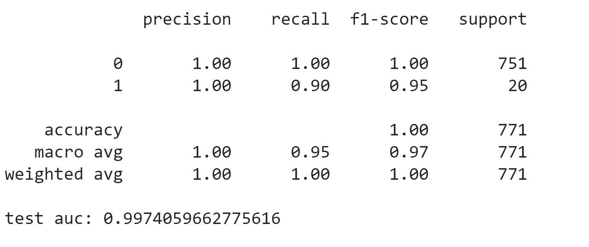
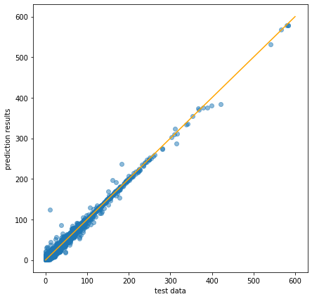
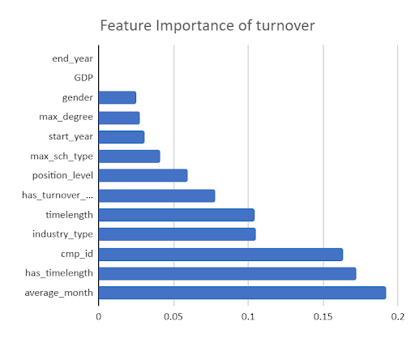
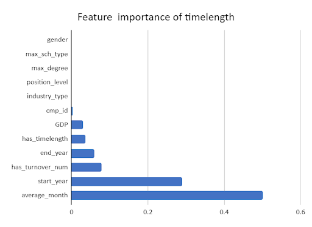
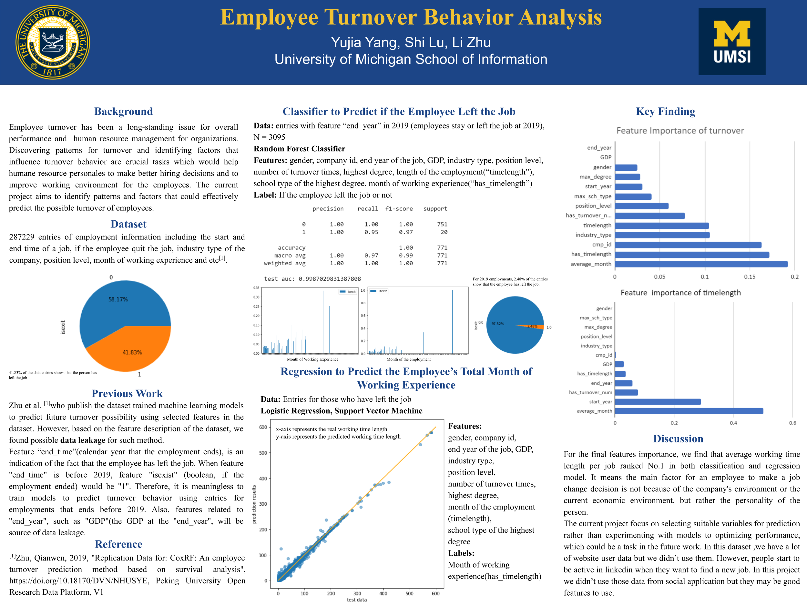

* lushi@umich.edu, izhuli@umich.edu, yyjia@umich.edu

[Back to Homepage](../index.html)

# Abstract
When excellent employees leave, companies face huge losses. Employee turnover can be a significant factor in companies’ financial situations. In the current project, we utilized machine learning techniques to predict employee turnover behavior and identified important factors that affect such behavior based on a dataset that was collected from three job-searching platforms[1]. We found the company and average working month of this employee is the most important factor in turnover. On the other hand, the average working month and start year of one employee is the most important factors of the total length of working experience.

# Introduction
The role played by employees in an organization cannot be overemphasized; employees are the backbone of any business’s success. High employee turnover is a warning sign of low morale among an organization’s workforce, which is one of the factors that affect the productivity of the organization. Employee turnover has been a long-standing issue for overall performance and human resource management for organizations.

Although the phenomenon of employee turnover is common in enterprises, companies will be relatively reactive and rather than proactive because they do not know in advance that employees have intentions to leave. On the one hand, for some excellent technical or management personnel, the company cannot reasonably appease or retain it as early as possible; on the other hand, in the face of the sudden departure of employees, the company may not be able to immediately recruit the appropriate employees or arrange the responding post for Job transfer. So there is an urgent need to provide a way to predict employee turnover.

Discovering patterns for turnover and identifying factors that influence turnover behavior are crucial tasks that would help human resource personnel to make better hiring decisions and to improve the working environment for the employees. The current project aims to identify patterns and factors that could effectively predict the possible turnover of employees. We hope to use the machine learning model to abstract the most important features of employee turnover and find out the most accurate techniques for prediction.

# Methods
## Description of datasets
The current version of the dataset was acquired from the Peking University Open Research Data Platform[18], which was originally collected from an online professional social platform and the Chinese Education Department. The dataset includes 287229 entries of employment information including the start and end time of a job, if the employee quit the job (1 means yes and 0 means no), industry type of the job, month of working experience of the job, position level, max education degree of the employee, total month of working experience(tenure), counts of turnover number, GDP growth annual(%), and industry type.

|Feature name|Feature description|
|------------|-------------------|
|start_year|Year of the employment started|
|end_year|Year of the employment ended|
|GDP|GDP annual growth rate at the year that the employment ended
|has_trunover_num|Times of turn over of the employee|
|has_timelength|Total number of months since the first job of the employee (tenure)|
|timelength|Number of months of the employment|

Table 1. Numerical features used in the turnover behavior analysis model

|Feature name|Feature Description|
|------------|--------|
|gender|gender|
|cmp_id|Unique id of the the company|
|industry_type|Industry type of the employee|
|max_degree|Highest degree that the employee acquired|
|position_level|Position level of the employment|
|max_sch_type|School type of the highest degree the employee acquired|
|isexit|Whether the employee left the job|

Table 2. Categorical features used in the turnover behavior analysis model

## Data Leakage Issues
Zhu et al. [1]who publish the dataset trained machine learning models to predict future turnover possibility using selected features in the dataset. However, based on the feature description of the dataset, we found possible data leakage for this method.

Feature “end_time”(calendar year that the employment ends), is an indication of the fact that the employee has left the job. When feature "end_time" is before 2019, feature "isexist" (boolean, if the employment ended) would be "1". Therefore, it is meaningless to train models to predict turnover behavior using entries for employments that ends before 2019. Also, features related to "end_year", such as "GDP"(the GDP at the "end_year"), will be a source of data leakage.

To avoid further impact of the data leakage issues, we decided to split the dataset into two parts (entries with “end_time before 2019 and  entries with “end_time in 2019) and use them for different purposes. For entries with “end_time” in 2019, we would like to use the data for classification predicting turnover. For entries with “end_time” before 2019, which means we are sure that those employees left their jobs, we would like to use the data to predict the time length of working experience since their first job.

## Summary of algorithms
### Binary classifier for employee turnover using the dataset in 2019
Considering the datalekage issue of the data set, binary classification for employee turnover will be conducted using employment entries that have the “end_year” in 2019. Random forest is used for model training. Random forest is a classifier that contains multiple decision trees, and the output category is determined by the mode of the categories output by the individual trees.

For model parameters, we pay attention to n_estimators and max_depth. n_estimators is referring to the maximum number of iterations. Generally speaking, if n_estimators is too small, it is more likely to underfit. If n_estimators is too large, the time of calculation will be longer, and when the model has a large number of n_estimators, increasing the number of  n_estimators will not makes the model better. So we chose 20 and 70 to tune the model. max_depth is referring to decision tree maximum depth, In general, this value can be ignored when there is little data or features. If the model has a large number of samples and many features, it is recommended to limit this maximum depth. Common values can be between 10-100. Here we choose 20 and 50 due to a large number of data.

After using GridSearch, we selected best parameters to create random forest classifier and train the model. The F-1 score is 0.97.

### Regression model for length of working experience using dataset before 2019
Entries with “end_year” before 2019 will be used to train and test for with Random Forest Regression. Parameter max_depth is set to 100 and 500 to tune the model because it decided the maximum depth of the tree. The tree will be deep because of our plentiful data. Min_samples_split is the minimum number of samples required for internal node re-segmentation. This value limits the conditions for the subtree to continue to split. If the number of samples of a node is less than min_samples_split, it will not continue to try to select the best features for splitting. Because we have a large number of data and features, we choose 2, 5 and 10 to tune the model.

For binary classifier, we used the best parameters to create the model and train it. The mean absolute error is 1.55, which means our model is accurate.

## A description of code
For the dataset, there are many data anomalies or missing data in columns. For example, in the column “max_degree”, 0 represents “data anomalies”. We drop all the uncertain groups.

Due to data leakage, we filtered the dataset for two sub-sets for classification and regression model. Then we used train_test_split to split the train and test set. MinMaxscale is conducted for normalization. Then put the train set in GridSearchCV model to find the best parameter. Finally, we used the best estimator to predict the test set, and evaluate the results.

# Evaluation and Analysis
For classification model performance, precision, accuracy and  f1 score and test AUC were used to evaluate the model performance. For the regression model,  MSE is used for evaluation.

Classification model has high performance, with high f1(0.95), accuracy(1.00), and test AUC(0.99). For data entries that is in 2019, only 2.59% of the entries indicating that the employee did not leave their jobs. As a result of imbalanced data, the accuracy is high, since having all test cases predicted as “left their job” would result in 97.41% for accuracy. GDP will be the same for entries from 2019, which makes this feature unhelpful for the prediction.

Due to the limitation of this sub-dataset, we choose to use features of employees who left their job to predict tenure. We chose those who left their jobs because they have longer tenure. Final evaluation of the regression show as below: the mean squared error is 10.23, which is small. For Figure 2, the x-axis represents the real data, and y-axis represents the predicted data. Generally speaking, this is a linear correlation between them. From this picture, we can draw the conclusion that our model is accurate.

# Related Work
Employee turnover was interpreted as a leak or departure of intellectual capital from the employing organization by Stoval and Bontis[1]. Age, tenure, pay, overall job satisfaction, and employee’s perceptions of fairness were found to be the strongest predictors for voluntary turnover [2]. Personal or demographic variables, specifically age, gender, ethnicity, education, and marital status, were often discussed and found useful to predict turnover behavior [3], [4], [5], [6], [7]. In terms of the working environment, salary, working conditions, job satisfaction, supervision, advancement, recognition, growth potential, burnout were covered in previous work [8], [9], [10], [11].

Because of the crucial impact that turnover has on organizations, previous literature have tried to identify the turnover pattern and use machine learning methods to predict turnover behavior. Jantan, Hamdan and Otman[12]experimented with different models such as decision tree, Random Forest Multilayer Perceptron for prediction, recommending decision tree. Nagadevara Srinivasan and Valk[13] uses absenteeism, job content, tenure and some demographic information to predict turnover behavior, using Classification and regression trees.Hong, Wei and Chen[14] prefer a logistic regression model for such prediction. Marjorie Laura Kane Sellers[15] focus on personal factors such as mental health components, and a binomial logit regression works the best for predicting voluntary turnover. Alao and Adyemo[16] experiment with different algorithms for decision trees to predict employee attrition. Saradhi and Palshikar[17]ends up choosing support vector machines after using Aaive Bayes, logistic regression, decision trees, and random forests to predict turnover behavior.

In this project, we chose to use dataset from Zhu et al. [18]who trained machine learning models to predict future turnover possibility using selected features in the dataset, although based on the feature description of the dataset, we found possible data leakage for such a method. Among different previous work, decision trees or random forests are fairly popular. Therefore we used decision trees for its good performance and interoperability. 

# Discussion
## Overall results
For the final features importance, we find that average working time length per job ranked No.1 in both classification and regression model. It indicated that if an employee likes to change jobs frequently, he or she cannot work long for any company. Conversely, if a person does not like to change jobs, then this person will have a high probability of working for a long time in a company. The main factor for an employee to make a job change decision is not because of the company's environment or the current economic environment, but rather the personality of the person.

## What I learned from the project
From this project, we learned where and how to find good datasets. Universities’ open-source platform, Kaggle, government websites are resourceful platforms for academic purposes. Journal articles and code scripts a lot time would come with the data and serves as good educational materials for inspiration.

We also gain familiarity for exploring data with machine learning techniques, and our problem-solving skills have improved by using various methods to manipulate, interpret the dataset trying to find some real social impact. For this project, we explored with different clustering methods, trying to find groups of employees that carry characteristic features. Although no interesting features are found for differences among the groups, we discover the data leakage issue. Then we tried to transform the data based on companies, but neither clustering or prediction model filed any meaningful social significance.

In class, we learned many machine learning models that have different features. Their performance vary according to different conditions of use, such as databases. That’s why collection good data is a necessary step of machine learning research. Besides, the impact of data leakage on machine learning is huge. We didn’t notice it at the beginning, which wasting effort in doing clustering.

After doing this project, we know the correct way to do machine learning research. We need to spend time finding a database that is as good as possible. Then we need to clean the dataset, remove unusual data and scale the dataset. More importantly, we will need to choose different models based on their different applications, tune parameters and find the best one. Before fitting the model, we need to consider data leakage as well as our purpose of prediction or classification. Finally, we will see the accuracy and practical significance of our models.

## Future Work
In this dataset ,we have a lot of website user data but we didn’t use them. However, based on my experience, I know people start to be active in linkedin when they want to find a new job. In this project we didn’t use those data from social application but they may be good features to use.

While working on this project, we did a lot of work about exploring data like clustering and so on. Finally we found the best way to process data and build model. But the current project focuses on selecting suitable variables for prediction rather than experimenting with models to optimize performance, which could be a task in the future work. We can try the following models in the future:

Different methods of data augmentation should be experimented to improve model performance
Statistic analysis of the selected features’ effects of the turnover intention.
Experiment with more model like CNN

# Reference
[1] M. Stoval and N. Bontis, “Voluntary turnover: Knowledge management – Friend or foe?”, Journal of Intellectual Capital, 3(3), 303-322, 2002.

[2] J. L. Cotton and J. M. Tuttle, “Employee turnover: A meta-analysis and review with implications for research”, Academy of management Review, 11(1), 55-70, 1986.

[3] L. M. Finkelstein, K. M. Ryanand E.B. King, “What do the young (old) people think of me? Content and accuracy of age-based metastereotypes”, European Journal of Work and Organizational Psychology, 22(6), 633-657, 2013.

[4] B. Holtom, T. Mitchell, T. Lee, and M. Eberly, “Turnover and retention research: A glance at the past, a closer review of the present, and a venture into the future”, Academy of Management Annals, 2: 231-274, 2008

[5] C. von Hippel, E. K. Kalokerinos and J. D. Henry, “Stereotype threat among older employees: Relationship with job attitudes and turnover intentions”, Psychology and aging, 28(1), 17, 2013.

[6] S. L. Peterson, “Toward a theoretical model of employee turnover: A human resource development perspective”, Human Resource Development Review, 3(3), 209-227, 2004.

[7] J. M. Sacco and N. Schmitt, “A dynamic multilevel model of demographic diversity and misfit effects”, Journal of Applied Psychology, 90(2), 203-231, 2005.

[8] D. G. Allen and R. W. Griffeth, “Test of a mediated performance – Turnover relationship highlighting the moderating roles of visibility and reward contingency”, Journal of Applied Psychology, 86(5), 1014-1021, 2001.

[9] D. Liu, T. R. Mitchell, T. W. Lee, B. C. Holtom, and T. R. Hinkin, “When employees are out of step with coworkers: How job satisfaction trajectory and dispersion influence individual-and unit-level voluntary turnover”, Academy of Management Journal, 55(6), 1360-1380, 2012.

[10] B. W. Swider, and R. D. Zimmerman, “Born to burnout: A metaanalytic path model of personality, job burnout, and work outcomes”, Journal of Vocational Behavior, 76(3), 487-506, 2010.

[11] T. M. Heckert and A. M. Farabee, “Turnover intentions of the faculty at a teaching-focused university”, Psychological reports, 99(1), 39-45, 2006.

[12] H. Jantan, A. R. Hamdan, and Z. A. Othman, “Towards Applying Data Mining Techniques for Talent Managements”, 2009 International Conference on Computer Engineering and Applications, IPCSIT vol.2, Singapore, IACSIT Press, 2011.

[13] V. Nagadevara, V. Srinivasan, and R. Valk, “Establishing a link between employee turnover and withdrawal behaviours: Application of data mining techniques”, Research and Practice in Human Resource Management, 16(2), 81-97, 2008.

[14] W. C. Hong, S. Y. Wei, and Y. F. Chen, “A comparative test of two employee turnover prediction models”, International Journal of Management, 24(4), 808, 2007.

[15] L. K. Marjorie, “Predictive Models of Employee Voluntary Turnover in a North American Professional Sales Force using Data-Mining Analysis”, Texas, A&M University College of Education, 2007.

[16] D. Alao and A. B. Adeyemo, “Analyzing employee attrition using decision tree algorithms”, Computing, Information Systems, Development Informatics and Allied Research Journal, 4, 2013.

[17] V. V. Saradhi and G. K. Palshikar, “Employee churn prediction”, Expert Systems with Applications, 38(3), 1999-2006, 2011.

[18]Zhu, Qianwen, 2019, "Replication Data for: CoxRF: An employee turnover prediction method based on survival analysis", https://doi.org/10.18170/DVN/NHUSYE, Peking University Open Research Data Platform, V1

# Poster

[Back to Homepage](../index.html)

