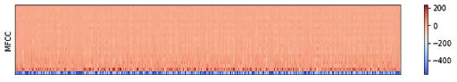
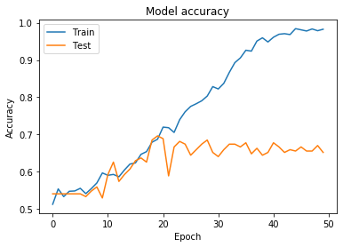
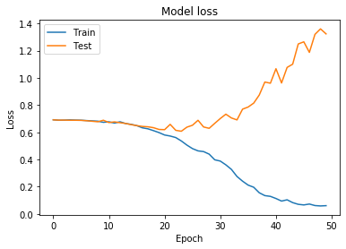
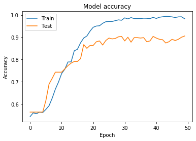
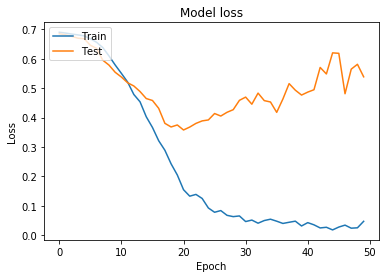
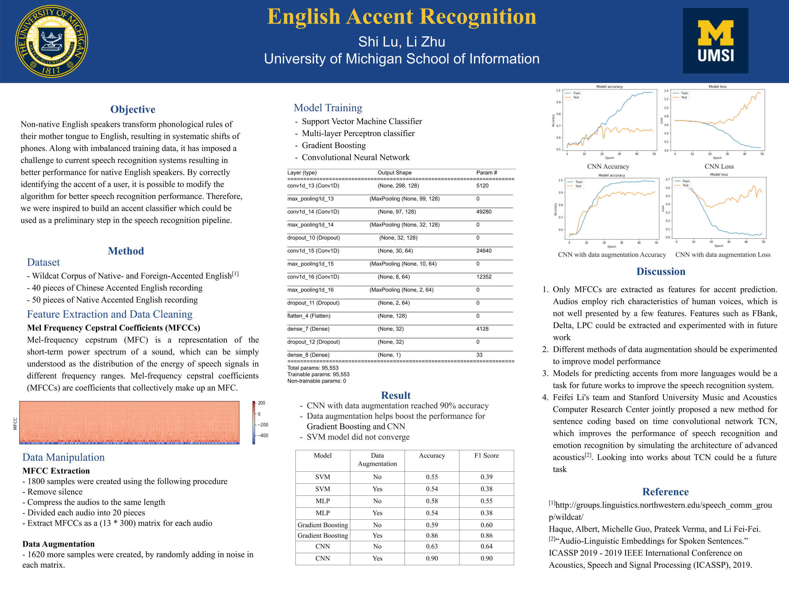

* lushi@umich.edu, izhuli@umich.edu

[Back to Homepage](../index.html)

# Abstract
When people with different native languages speak English, their phones are systematically changed which leads to a lower performance for speech recognition systems. A better model for classifying the native accent of an English speaker can help with the recalibration of the speech recognition for better performance. The current project utilized machine learning models to train classifiers predicting if an English speaker is with a native accent or a Chineseaccent. Audios were converted to MFCCs vectors and were used to train SVM,MLP,Gradient Boosting,and CNN models. CNN model has the highest accuracy among these models, while data augmentation could improve the accuracy of the CNN model.

# Introduction
A language may be pronounced in different ways in different regions of that language speaking area. Non-nativeEnglishspeakerstransformphonologicalrulesoftheirmothertonguetoEnglish,resulting in systematic shifts of phones. Along with imbalanced training data, it has imposed a challenge to current speech recognition systems resulting in better performance for native English speakers. By correctly identifying the accent of a user, it is possible to modify the algorithm for better speech recognition performance. Therefore, we were inspired to build an accent classifier which could be used as a preliminary step in the speech recognition pipeline.

The accent bias in speech recognition has been well aware since it directly affects how accurate  state-of-the-art automatic speech recognition systems work. According to Tatement[1], there are  robust differences in accuracy across both gender and dialect in some automatic speech recogni- tion(ASR) systems, such as Youtube’s auto speech transcriber and speaker’s sociolinguistic identity may negatively impact their ability to use automatic speech recognition. Upadhyay[2] also points out that statistically gender and accent to be the most important factors of speaker variability affecting the fluency of ASR systems.

In general, there are three ways to approach this problem - collecting high quality and balanced data, adding in speaker identity information as features, and algorithm adaptation[3]. Researchers have been trying to collect audio data to form corpus, and this is going to be expensive and time-consuming tasks in the long term. Speaker identity information could be the geographic location or socio-economic information that is related to one’s accent or other information that could help capture the stable variation between groups of talkers[4]. The current project would try to approach this problem by training models that could help with the ASR to recalibrate or adapt to different accented speakers

# Related Work
Before the rise of the popularity of the deep learning model, language dictionaries were created to classify the speaker’s accents, and the model was based on specific phonological features[5].This model is text-dependent, based on how different people pronounce the same phoneme in different ways. The data collection process is expensive and relies on the quality of the data in a meticulous way. 

Models with acoustic features and prosodic features gain their popularity because they are no longer text-dependent. Sinha et al.[6] investigates the influence of dialectal variations, by measuring and analyzing certain acoustic features such as formant frequencies, pitch, pitch slope, duration and intensity of vowel sounds. Those features would be further processed into different acoustic coefficients including Mel-frequency cepstrum(MFCCs), and later become vectors for machine learning purposes. DeMarco and Cox[7] use only MFCCs and project the MFCCs in different vector spaces to experiment for different models.

As for machine learning models for accent classification, dialect-specific Gaussian mixture models[8], a variety of SVM, LDA[9] being conducted. Also, CNN, Naïve Bayes, and logistic regression are47 seen in NLP student projects[10].

# Experiment

## Dataset

Wildcat Corpus of Native and Foreign-Accented English[11] is an audio corpus collected by researchers from Northwest University. It contains English audio recordings both scripted and unscripted speech of native and non-native speakers. Considering the scope of this current project, we choose 40 pieces of scripted Chinese Accented English recordings and 50 pieces of scripted Native Accented English recordings as the original data.

## Preprocessing
In this project, we extracted Mel Frequency Cepstral Coefficients (MFCCs) as the most important feature from audio recordings. Mel-frequency cepstrum (MFC) is a representation of the short-term power spectrum of a sound,which can be simply understood as the distribution of the energy ofspeech signals in different frequency ranges. Mel-frequency cepstral coefficients (MFCCs) are coefficients that collectively make up an MFC.

In order to extract MFCC, we created 1800 samples using the following procedure with the help of the Librosa [11] library.Firstly we split each audio to 5000 snippets and delete snippets whose volume is lower than 0.04. In this way we deleted silence. Then we compressed the audio to the same length because different people speak at different speeds. If we proceed without compressing them to the same length, their feature parameters would not be able to be compared with each other because their MFCC vector length will be different. Then we divided each audio into 20 pieces. There are two advantages to doing so. One is that we have more samples and another is that the length of each data is shorter, which means our model can use less time to process each of them. Finally, we extracted MFCCs as a (13 * 300) matrix for each audio.

## Data Augmentation
In order to boost the performance of the models and test model performance with noise,anaugmented version of the data was created. We augmented data by randomly generating location and value of data augmentation. Here the actual meaning of data augmentation is adding noise to primary audio. Among the 1800 samples created above, 10% of the data were randomly selected to be preserved for testing. The rest of the 1620 samples would be created a data augmented version. For each of the sample, 5 of the 13 dimensions and for each of the 5 dimensions, 50 out of the 300 arrays would be randomly chosen to be added noise. Noise was created with normal distribution, with mean = 0.2 and80 SD = 0.005.

## Methods

After reprocessing audio recordings and convert them to vectors which can fit with machine learning models, we firstly applied traditional machine learning methods Support Vector Machine, Gradient Boosting using the Sci-kit Learn library. Support Vector Machine and Gradient Boosting model will serve as the base lines for neural network models Multi-layer Perceptron(MLP) and Convolutional Neural Network(CNN). Multi-layer Perceptron(MLP) is also implemented using the Sci-kit Learn library. Convolutional Neural Network(CNN) is implemented by using the Keras framework. The following table shows the structure the CNN layers.

|Layer(type)|Output|ShapeParam|
|-------|------|----------|
|conv1d_13(Conv1D)|(None, 298, 128)|5120|
|max_pooling1d_13|(MaxPooling (None, 99, 128)|0|
|conv1d_14|(Conv1D)(None, 97, 128)|49280|
|max_pooling1d_14|(MaxPooling (None, 32, 128)| 0|
|dropout_10(Dropout)|(None, 32, 128)|0|
|conv1d_15 (Conv1D)| (None, 30, 64)|24640|
|max_pooling1d_15| (MaxPooling (None, 10, 64)| 0|
|conv1d_16| (Conv1D) (None, 8, 64) 12352
|max_pooling1d_16| (MaxPooling (None, 2, 64) |0|
|dropout_11 (Dropout)| (None, 2, 64) |0|
|flatten_4 (Flatten)| (None, 128)| 0|
|dense_7 (Dense)| (None, 32) |4128|
|dropout_12 (Dropout)| (None, 32)| 0|
|dense_8 (Dense)| (None, 1) 33|
|Total params of CNN model: 95,553|
|Trainable params of CNN model: 95,553|
|Non-trainable params of CNN model: 0|

Table 1: Layers of CNN Model

## Result
For each model, the accuracy and F1 score is calculated. Results are shown in Table 2. Accuracy for94 SVMisaround0.54,andtheF1scoreislow. Thisisbecausethesupportvectormachineisnotstrong95 at explaining high-dimensional mapping of kernel functions, especially radial basis functions. This96 means that the SVM underfits and the classifier fails to perform better than at chance. MLP, Gradient97 Boosting(without data augmentation) also have the same performance. By comparing each model’s98 performance, we found the best model is CNN(with data augmentation). The reason for that might99 be CNN is suitable to process multi-dimensional data.100 We did data augmentation with each model and compares their performance before and after data101 augmentation. Data augmentation helps boost the performance only for Gradient Boosting and CNN,102 but not MLP or SVM, which means Gradient Boosting and CNN model can process audio with noise.103 The highest CNN with data augmentation reached 90% accuracy.104 Information provided by MFCCs is not highly complex, a relatively simple CNN, rather than a105 pre-train model such as VGG, would work in this case. According to the figures for loss function, we106 found the reason why CNN performs better with noise can be that data augmentation did help with107 void overfitting to some extent.

|Model|Data Augmentation|Accuracy|F1 Score|
|---|---|---|---|
|SVM|No|0.55|0.39|
|SVM|Yes|0.54|0.38|
|MLP|No|0.58|0.55|
|MLP|Yes|0.54|0.38|
|Gradient Boosting|No|0.59|0.60|
|Gradient Boosting|Yes|0.86|0.86|
|CNN|No|0.63|0.64|
|CNN|Yes|0.90|0.90|

Table 2: Classification Results

# Analysis
The current project shows the capability of using CNN to classify speaker’s English if a piece of audio is given. MFCCs were extracted as matrices to be used as the training data for different models.A CNN with data augmentation perform the best among all,the default SVM model is not performing better than chance.

The test accuracy is surprisingly low and only Gradient Boosting(with data augumentation) performed well at 86% test accuracy. But is is still not performing as well as the neural networks as expected. For this project, the SVM and Gradient Boosting model used the default setting as in the Ski-learn package, without adjusting any parameter. It is possible that the SVM is our case is not linear, and kernel tricks should be applied to the SVM in order to gain a better performance. For future task, grid-search for parameters or getting some mathematical intuition about the kernels would be helpful to improve performance.

Among the neural networks, CNN performed better than MLP. CNN is good at extracting features through layers of matrices. MFCCs matrices and image data are alike in this sense. This could be a reason why CNN is performing well for MFCCs data. However the data augmentation process is not alike for CNN and MFCCs. It is possible to experiment with different ways to add in noise for MFCCs.

Only MFCCs are extracted as features for accent prediction. Audios employ rich characteristics of human voices, which is not well presented by a few features. Features such as FBank, Delta, LPC could be extracted and experimented with in future work Different methods of data augmentation should be experimented to improve model performance. Other statistical audio features like MFCC n-order derivatives (deltas) and mel-spectrograms could be used, or prosodic features such as range and sub-band energies could also be used.

Models for predicting accents from more languages would be a task for future work to improve the speech recognition system. More classes of non-native speakers could beincluded to see if our model is able to handle a wider variation of non-native speakers and to discern more subtle variations across those classes.

Also more complex neural network architectures can be created by combining several types of neural network architectures, for example LSTM and DNN taking a final weighted probability. Feifei Li’s team and Stanford University Music and Acoustics Computer Research Center jointly proposed a new method for sentence coding based on time convolutional network TCN, which improves the performance of speech recognition and emotion recognition by simulating the architecture of advanced acoustics[12]. Looking into works about TCN could be a future task.

# Conclusion
We built a CNN model which can be used to recognize English accent with noise with 90% accuracy. In order to process audio files, We read them with libsora library and convert them to audio vectors. Then we extracted mfcc of audio recordings and used them to train four machine learning models, SVM model, MLP model, Gradient boosting model and CNN model. In addition to testing audio samples from existing databases,we also added noise to these samples to test our model’s performance under abnormal conditions by data augmentation. After comparing their accuracy and F1-score under different conditions, we found the CNN model performs the best.

# References
[1][3] Tatman, Rachael. Modeling the Perceptual Learning of Novel Dialect Features [Dissertation/Thesis].ProQuest Dissertations Publishing; 1/1/2017.

[2] Upadhyay, Rishabh, Accent Classification Using Deep Belief Network, University of Mumbai, page 1, 2017.169

[4]Guoli Ye, Chaojun Liu, Yifan Gong. Geo-location dependent deep neural network acoustic model for speech recognition. 2016 IEEE International Conference on Acoustics, Speech and Signal Processing (ICASSP). IEEE; 3/2016. p. 5870–5874.

[5] Humphries, J.J, Woodland, P.C. The use of accent-specific pronunciation dictionaries in acoustic model training. Proceedings of the 1998 IEEE International Conference on Acoustics, Speech and Signal Processing, ICASSP ’98 (Cat No98CH36181). IEEE; 1998. p. 317–320 vol.1.

[6][8] Sinha, Shweta, Jain, Aruna, &160 Agrawal, Shyam S. (2019). Empirical analysis of linguistic and paralinguistic information for automatic dialect161 classification. Artificial Intelligence Review, 51(4), 647–672. Dordrecht: Springer Netherlands.

[7] [9] Native Accent Classification via i-Vectors and Speaker Compensation Fusion Andrea DeMarco and Stephen Cox Proc. 16th International Conference on Spoken Language Processing (Interspeech), Lyons, August 2013

[10] Wang, X., Guo, P., Lan, T., Fu, G., Study of Word-Level Accent Classification and Gender Factors http://students.cse.tamu.edu/xingwang/courses/csce666_accent_native_indian.pdf

[10] Neidert, J., Chen, P., Lee, J., Foreign accent classification, http://cs229.stanford.edu/ proj2011/ChenLeeNeidert-ForeignAccentClassification.pdf

[11] http://groups.linguistics.northwestern.edu/speech_comm_group/wildcat/

[12] Haque, Albert, Michelle Guo, Prateek Verma, and Li Fei-Fei. [2]“Audio-Linguistic Embeddings for Spoken Sentences.” ICASSP 2019 - 2019 IEEE International Conference on Acoustics, Speech and Signal Processing (ICASSP), 2019.

# Poster

[Back to Homepage](../index.html)

