[Back to Homepage](../index.html)

* lushi@umich.edu, huanzhao@umich.edu, yyjia@umich.edu
* Instructor: ceren Budak

# Executive Summary
Predicting traffic has been important for websites’ daily services. Developing efficient models for Wikipedia’s page traffic would deepen our knowledge about people’s behavior on Wikipedia and potentially for other crowdsourcing pages. The current project attempted to experiment with incorporating time series data from a linked page trying to improve the prediction accuracy of future traffic of a page. 

The current study experimented with three time-series models. The baseline model uses the monthly traffic of 2019 of a page to predict the monthly traffic of January of 2020. The random neighbor model randomly selects a page which has a hyperlink to the focal page and uses the 2019 data of the focal page and the neighboring page to predict the monthly traffic of January of 2020. The similar neighbor model also uses data from the focal and a neighboring page,  but the neighbor is selected based on its content similarity to the focal page. 
Our main findings are 

  * baseline model, in general, has the best performance with the smallest MSE, MAE, and MAPE.

  * Random neighbor model and similar neighbor model have much larger MSE than the baseline model does, but the MAE are similar among the three models.

  * Prediction with a similar neighbor model has better prediction performance than with the random neighbor model on popular pages.

# Introduction and Motivation
As digital technologies have made knowledge sharing more accessible, large amounts of content are generated and collected from collaborative information input. Wikipedia, a predominant example of collaboration information resources, gains the most popularity of its kind. The need for exploring methods of effectively predicting the future number of visits for each page from existing data has been increasing.

Our research attempt is to see if adding in the time-series data of a page which a page is linked from would improve the prediction performance of predicting the pageview. Based on this purpose, we use the historical page traffic time-series format and the corresponding page content from Wikipedia dumps database(Wikimedia, 2020) to forecast future traffic. 

The methodology adopted in this project for forecasting time series data was the VAR(Vector Autoregression) model as our baseline Model 1. Then we used two other models to compare the performance. Neighbors’ pageviews were taken into consideration for Model 2 and Model 3. For Model 2, the neighbors are randomly selected. For Model 3, neighbors are selected by the highest similarity of page content.

Our prediction could have practical applications to predict and monitor different types of events from social to business, from simple topics in everyday life to massively affecting public issues. For example, it could work as a reference for understanding the user behavior for collaborative information sharing and evaluating if the content strategy delivers the expected traffic result of the content contributor, or be incorporated in social researches for exploring future trends based on historical data.

# Past Work
Time-series methods have been used in many prediction practices related to online behavior. Li, Jia & Moore, Andrew. (2008) found that large prediction errors could be caused by occasional sudden page traffic changes. In order to identify these changes and avoid prediction errors, they developed an Elastic Smooth Season Fitting (ESSF) algorithm for better extracting seasonal patterns. The algorithm derived the yearly season by minimizing the residual sum of squares under smoothness regularization.

Researchers have been interested in using time-series methods for all kinds of business problems such as allocating computer resources, estimating upcoming revenue, investigating advertising growth, and supporting online shopping business. Gupta and Chaudhari(2016) conducted Time series analysis on website visitors’ traffic and pageviews by identifying dominant factors with methods including Weka (Waikato Environment for Knowledge Analysis), Gaussian, Linear Regression, Multilayer Perceptron, and SMO Regression. Petluri and Al - Masri(2018) used the existing Web Traffic Time Series Forecasting dataset by Google to predict future traffic of Wikipedia articles to build a  prediction model based on a) number of hits, b) features which are extracted from page URLs, c) day of the week - analyzes the weekly seasonality information, d) year-to-year autocorrelation (quarterly and yearly), e) page popularity and, f) lagged pageviews. 

The usage of Wikipedia as a source of information to detect and predict events in the real world has been limited to the work by Mestyán, M., Yasseri, T., and Kertész, J. (2013). This research used Wikipedia data to predict box office success, and Osborne et al.(2012) used Wikipedia page traffic to develop an algorithm for detecting the first story on Twitter. Then work by Georgescu et al. (2013) worked with Wikipedia edits data as entity-specific news tickers and time-lines generators. Wikipedia data has also been used by Moat, Curme, and Avakian (2013)  for financial fluctuations to demonstrate the effectiveness of Wikipedia traffic data on time series forecasting.

# Datasets & Data Manipulation
Our datasets were acquired from Wikipedia dumps(Wikimedia, 2020), which is a collection of datasets offered by Wikipedia. This data collection allows us to access Wikipedia data without an internet scraper which would possibly create a large volume of additional traffic and result in IP addresses being banned. Three raw datasets were used in the current project and were combined and filtered in various ways in order to serve the purpose of building time-series prediction models.

  + Pageview dataset: monthly traffic of each page in 2019 and January 2020
  + Content dataset: full page content of all English Wikipedia pages
  + Internal Page Link dataset: internal links among Wikipedia pages

## Pageview dataset
The pageview dataset contains the monthly traffic of each Wikipedia page in 2019. The files were downloaded as 12 zipped, and each contains the data of one month in 2019. Three variables were included, and examples are shown as below：
  + Category: letter code of the subproject and project of the page. 
The subproject was the language code, such as “en”, “es”, “ch”, etc. The project is the content source that the data comes from. Some examples are “b” (Wikibooks), “d” (dictionary), “m” (mobile), “n” (Wikinews), “q” (Wikiquote), “s” (Wikisource), “v” (Wikiversity), and “voy” (Wikivoyage). For different versions of datasets, the Wikipedia in English could be represented as “en” or “en.z”. There could be more than one project to represent a specific source. For example, “en.q” means the data comes from English Wikiquote, “en.m.n” means the data is from the English Wikinews mobile site. 

  + Pagename: the name of the page in Wikipedia
  + Pageview: total number of visits to a specific page in a specific month

In the current project, data for only English Wikipedia pages, category “en.z”, with at least one view for every month in 2019 would be included for further models and evaluation. Although over 8 million monthly pageviews recorded were in the complete dataset for pageview, not every page has its total monthly pageview recorded for every month in 2019, because new pages are created and old deleted every day for various reasons while some pages are overly popular, and some are seldom visited. To avoid excessive amounts of missing data, pages without at least 1 view for every month in 2019 would be filtered out. Considering the Content dataset only contains information for English pages, category “en.z”, we could only use the English pages for further model building. 
The average monthly pageview does not show seasonal trends in Wikipedia traffic. No large increase or decrease between any two months are shown in Figure 1. The mid 50 percent of pageview for each month is in the range of 25 to150, and while the upper whiskers are long, indicating that some pages receive much more traffic than most of the others.

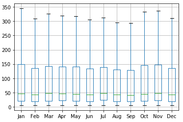

While most of the pageviews are below the mean = 444.42, the maximum is extremely high, see Table 2, a large amount of traffic comes from a few popular pages, which could be an indication of the Vital Few Rule. Log of average pageviews instead of the original data is used to show the distribution, see Figure 2. The distribution of the monthly pageview is right-tailed.

Table 1: Summary for Monthly Pageviews Counts for Each Page

| | Value|
|:------------:|:-------------:| 
| Minimum | 5.58 |
| 25% Quantile | 22.00 |
| 50% Quantile | 48.25 |
| 75% Quantile | 154.08 |
| Maximum | 734671.20 |

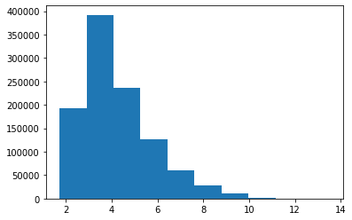

## Content dataset

The Content dataset contains all pages for English Wikipedia pages information including but limited to all text content, page redirection information, etc. We extract text information from each page, and on pages without redirect information would be used in the final dataset. Then text information for each page was transformed into vectors using Word2Vec algorithms that were built into the pySpark machine learning package.

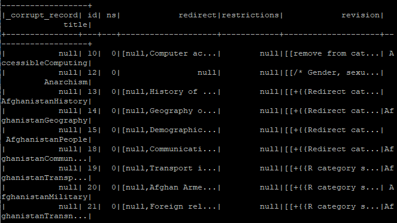

## Internal Page Link dataset

The Internal Page Link Dataset contains the records of connections among Wiki pages. Each record contains the unique id of one specific page and the title the pages which links appear on that specific page. 
Joining the page content vectors and internal page links, a dataframe with vectors of pages and their neighboring pages were created. We used a “from-to” connection as shown in Figure 4 to represent the neighbor relationship. 

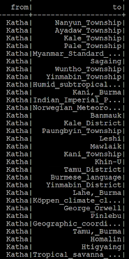

After a series of data manipulation processes, 427743 pages’ 12-month pageviews were used for time-series models.

# Methods
The current research attempt to see if by adding in the time-series data of a page which a page is linked from would improve the prediction performance of a model. For example, as shown in Figure 5, page A is a page we would like to predict its future pageview, and page B, C, D and E have hyperlinks to page A in their content. Page B, C, D and E are neighbors of page A. In the real world if the audience is interested in the neighbor page, they may click the hyperlink and jump to A, so pageview of page A can be influenced by their neighbors’ pageviews. In this case, we would like to know if adding in time-series data from Page B, C, D, and E would improve the prediction performance of predicting Page A’s future pageview. 

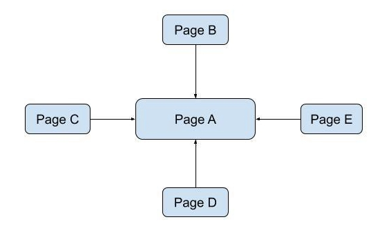

We experimented with three models for prediction and the features that the models are shown in Table 2. Model 1 is the baseline, we only use a time-series model on the 12-month pageviews in 2019 and predict the January 2020 pageview. Model 2 and model 3 will add on the neighboring’s pageview. For model 2, the neighbor is randomly picked. For model 3 will consider the similarity between the page and its neighbor, and then select the neighbor with the highest similarity.
For example, the Model 1 will use only 12-month pageviews of page A. The Model 2 will include not only page A’s pageviews, but also one of its neighbors’. Here we will randomly pick up one from pages B, C, D, and E as the neighbor of page A in Model 2. As for Model 3, we will calculate the similarity between page A and its four neighbors, then select one which is the most similar to the content of page A as its neighbor in Model 3.

Table 2: Features of the Three Proposed Models 

|         | Model 1 | Model 2 | Model 3|
|:-------:|:-------:|:-------:|:------:|
|Time-series Model (VAR) | x | x | x |
|Content Similarity| | | x |
|Page link| | x | x |

## Model 1: Baseline Time-series Model
### VAR
In the current project, the VAR(Vector Autoregression) model was used as our baseline for forecasting time series data. The VAR model, generalizing the single variable autoregressive (AR) model, allows multiple variables with correlation. AR algorithm employs the main component relationship between an observation and some number of lagged observations. As shown below, in a VAR model, one variable will be predicted by not only its own lagged observations but also the lagged values of the other model variables equally. 
$$y_{1,t} = c_1 + a_{1,1}y_{1,t-1} + a_{1,2}y_{2,t-1} + e_{1,t}$$
$$y_{2,t} = c_1 + a_{2,1}y_{1,t-1} + a_{2,2}y_{2,t-1} + e_{2,t}$$
For example, for page y1, the pageview of month t is from its pageview of month (t-1) and pageview of month (t-1) of its neighbor (y2). And for the neighbor page y2, its month t pageview also can be predicted by pageview of month (t-1) of y1 and its own pageviews of month (t-1). But here we don’t consider the neighbor’s pageview, so we will only pick up the result of y1.
For Model 1, we will only apply the pageviews of the page itself, without any neighbors. The monthly pageview of each article would be used to predict the monthly pageview of the latest month, using the VAR model. In Python, statsmodels package is available. The “var” function is applied. In addition, the VAR model required at least two time-series variables. For the baseline model, the same 12 months of pageview data of the page would be entered for both the variables, it means the page’s neighbor is itself.

## Model 2: Prediction with Random Neighbors

### Selections of the neighboring articles
For Model 2, we experimented with pageview data of the current observations and randomly selected its incoming neighboring article. For the code details, in the “From-To” dataframe, we dropped all the duplicate “To” page names (the page needs to be predicted), so only one pair of the neighbor and “To” was received. Then we joined their 12-month pageviews data for VAR prediction.

### VAR Model with Random Neighbors
“Var” function in the Pyspark’s statsmodels package would be used to perform a multivariable VAR model. In this model, a matrix containing both time-series data of each page and its randomly selected neighboring article could be entered. It means, as shown in the above VAR formula, to predict the pageview of one page, we set its neighbor as y2, and itself as y1.

## Model 3: Prediction with the Most Similarity Neighbors

### Word embedding
For the word embedding method, we choose to use the word2vec function provided by Pyspark.ml.feature package, which is based on the ‘Skip-Gram’ approach. Each article's first 2000 characters would be tokenized. After removing the stop words, we got a list of words for one article. Then we apply the word2vec function, and each word would be transformed into a vector. The vector presentation of the article would be calculated as the average of the vector of each word.

### Similarity between articles

In our methodology, the similarity between neighbors will be considered in order to investigate how close or how far that one page is to its neighbor according to their content. The similarity between any two articles would be calculated as the dot product of the vectors. Cosine similarity is widely used to measure how similarity between two documents.

Figure 6 shows a data frame created for Cosine similarity for each pair of neighbors. The higher the similarity, the more alike in content the two neighbors are. The page name and content of the starting page were represented by “from_id” and “from_vector”, the page name and content of the corresponding page were represented by “to_id” and “to_vector”. The “from_id” and the “to_id” could appear multiple times because one page might link to and be linked to multiple other pages.

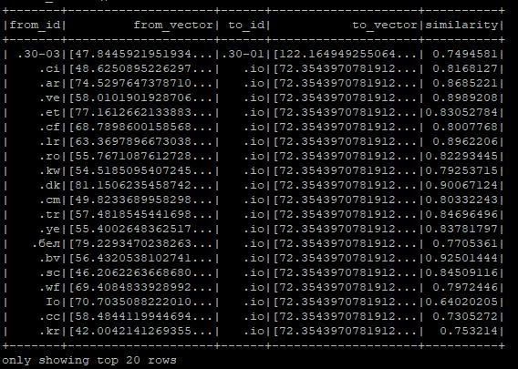

### Selections of the neighboring articles
We experimented with pageview data of the current observations and its most similar neighboring articles in model 3. In addition, there are two unique situations that make the result of model 2 and model 3 the same: page A only has one neighbor; also in model 2, due to the random selection, it is possible to select a neighbor with most similarity.

### VAR Model with Most Similar Neighbors
In model 3, a matrix containing both time-series data of each page and its most content similarity neighboring article could be entered.

# Result
Model 1 (the baseline), has better performance in terms of MSE, MAE, and MAPE than Model 2 (the random neighbor) and Model 3 (the similar neighbor) do, as shown in Table 3. The MAE for three models are similar, while the MSE of Model 2 and Model 3 are twice as large as the MSE of Model 1. This could suggest that, for model 2 and model 3, there are a few data points with extremely large prediction absolute residuals, while most of the prediction absolute residuals are small.

To examine if pages with different popularity employees drastically different errors among the three models, MAPE (shown in Table 3) and percent errors (please see Appendix Figure 9 for a heatmap) are calculated for every decile of the mean pageview. Model 1 employees better MAPE in every decile of the mean pageview. Model 2 and Model 3 have similar MAPE from 0 - 80% decile of the mean pageview, but Model 3 has a much lower MAPE from 80% - 100% decile, as shown in Table 4.

In order to closely compare the prediction performance between Model 2 (the random neighbor model) and Model 3 (the similar neighbor model)  among pages with different popularity, Absolute Percentage Error is calculated for all predictions, and the number of these predictions are counted for every decile of the mean pageview (please see Appendix Figure 10 for a heatmap). For 10% - 100% decile of the mean pageview, Model 3 has more predictions that have an absolute percent error within 0 - 10%. Model 3 also has overall fewer predictions for absolute percent errors which are larger than 100%, suggesting that Model 3 is, in general, less likely to have extremely large prediction errors than Model 2 is.

Table 3: MSE, MAE and MAPE for the Three Models

| | Model 1 (baseline) | Model 2 (random neighbor)| Model 3 (similar neighbor)|
|:------:|:-------:|:------:|:------:|
| MSE (Mean Squared Error) | 244377595.70 | 405386760.84 | 409314462.66 |
| MAE (Mean Absolute Error) |1563.52 | 1592.45 | 1597.46 |
| MAPE (Mean Absolute Percentage Error) | 0.36 | 0.43 | 0.44 |

Table 4: MAPE vs. for Decile for Mean Pageview

| Decile for Mean Pageview | Model 1 | Model 2 | Model 3 |
|:------:|:-------:|:------:|:------:|
| 0-10% | 0.27 | 0.30 | 0.30 |
| 10-20% | 0.26 | 0.29 | 0.29 |
| 20-30% | 0.24 | 0.29 | 0.29 |
| 30-40% | 0.23 | 0.27 | 0.27 |
| 40-50% | 0.22 | 0.26 | 0.26 |
| 50-60% | 0.31 | 0.38 | 0.37 |
| 60-70% | 0.42 | 0.51 | 0.52 |
| 70-80% | 0.41 | 0.51 | 0.51 |
| 80-90% | 0.54 | 0.71 | 0.64 |
| 90-100% | 0.69 | 0.89 | 0.83 |

In general, for all three models, the predicted value is correlated to the ground-truth. As shown in Figure 7, scatter plots for predicted value and the ground-truth are similar among the three models. A large number of data points are clustered around 0 to 50000 pages, and a few exceptional data points are scattered around.
A simple linear regression was calculated for all three models, based on the ground truth and the predicted value. Significant but weak correlations were found, for model 1, F(1,293152 ) = 69256.39, p < 0.01 with an R2 = 0.191, slop = 0.63; for model 2, F(1, 293152) = 60645.54, p < 0.01 with an R2 = 0.17, slop = 0.64; and for model 3, F(1, 293152) = 41607.30, p < 0.01 with an R2 = 0.124, slop = 0.69.

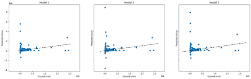

The correlation could be influenced by the highly skewed distribution of the data, having most of the data clustering on the lower end, with a few extremely large values. Logarithm transformation was conducted to both the predicted value and the ground ground-truth. Simple linear regression was calculated based on the log of ground truth and the log of the predicted value for all three models, shown in Figure 8. Significant and strong correlations were found for model 1, F(1,292219 ) = 8230000, p < 0.01 with an R2 = 0.97, with slop = 1.01; for model 2, F(1,291321 ) = 6285371, p < 0.01 with an R2 = 0.96, slop = 1.01; for model 3 (similar neighbor), F(1,291229 ) = 6300000, p < 0.01 with an R2 = 0.96, slop = 1.01.  For all three models R2 is close to 1.00, showing a strong correlation between the log of ground-truth and log of the predicted value, and slopes are close to 1.00 showing the values are similar for the predicted value and the ground-truth.

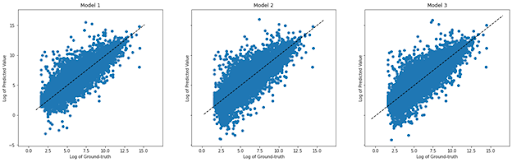

In order to understand how the neighbor pages are different in Model 2 and Model 3, the differences between the mean pageview of the neighbor page and its focal page were calculated. The cumulative percentages for different ranges of difference are shown in Table 5. 7.6% of the neighbor pages in Model 3 have an average pageview the same as their focal page, while there are 2.4% for Model 2. Considering the generally better performance of Model 3, this suggests that similar popularity between neighbor pages could be a more important contributor to correctly predicting future pageview with the current VAR time series model.

Table 5: Cumulative Percentage for Counts according to Difference between Neighbor and Focal Page in Mean Pageview

| Difference in Mean Pageview | 0 | +- 25 | +- 200 | +- 2000 |
|:------:|:-------:|:------:|:------:|:------:|
| Model 2 | 2.4% | 65.2% | 89.4% | 98.6% |
| Model 3 | 7.6% | 65.4% | 89.5% | 98.6% |

# Conclusion
The current project attempts to add in time-series pageview data from a linked page to improve the prediction performance of a VAR model. Baseline model, in general, has the best performance with the smallest MSE, MAE, and MAPE. The random neighbor model and the similar neighbor model have much larger MSE than the baseline model does, but the MAE is similar among the three models. This could possibly be due to some extremely large errors in the random neighbor and the similar neighbor model, while the majority of the data points are having small errors. Prediction with a similar neighbor model has better prediction performance than with the random neighbor model on popular pages. When comparing the pageviews between the focal page and its selected neighbor, the neighbor page will be more likely to have a similar average pageview as the focal page using cosine similarity to select for neighbors, rather than randomly picking a neighbor.

# Limitation and Future Work
  + Change the baseline model
  
The baseline model with a VAR model has a very large MAE and MSE. Changing to other time-series models, such as ARIMA or machine learning models, such as LSTM, to experiment with time-series data of linked pages may have a better performance.

  + Focus on different types of articles

Due to the extremely large errors on prediction with models that involved with data of a neighboring page, we believe for some of the articles have a better prediction performance with a neighbor than without. This could be due to differences in the articles' age, topics, length, etc. If we could have access to the categories of the pages, we could further experiment with the models with a specific category of the pages or compare the performance across the categories.

  + Consider the only similarity of page context regardless of the pages are linked or not
  
In the current project, we consider the neighbor has the highest similarity. If we were to determine a better prediction performance would be due to the content similarity of the pages or the link between the pages, we would need to experiment with a model that considers data from a page that is similar to the current page regardless of whether the page is linked to the focal page or not.

  + Consider the position of the focal page appear on the neighboring page
  
Due to the limitation of time, computation resources, and coding techniques, only the most similar neighbor of a page was selected for the models. For future experiments, we could consider the position of the current page appearing on its neighboring page. For some long articles, the reader has less interest in reading the later part of it. Chances of links being clicked are not equal such that people will be more likely to click on the links located at the front of an article. In future projects,  neighboring pages that have links to the focal page in their top two paragraphs could be selected for the models.

# Work Cited

Alis, C. M., Letchford, A., Moat, H. S. & Preis, T. (2015) Estimating tourism statistics with Wikipedia page views. WebSci '15 Web Science Conference, Oxford. 
 
Boopathi, T, Singh, S.B, Manju, T, Ramakrishna, Y, Akoijam, R.S, Chowdhury, Samik, Singh, N. Hemanta, et al. (2015). Development of temporal modeling for forecasting and prediction of the incidence of lychee, Tessaratoma Papillosa (Hemiptera: Tessaratomidae), using time-series (ARIMA) analysis. Journal of Insect Science, 15(1), 55. , Cary: Oxford Univ Press Inc.
 
Davis, R. A. (1991). Time Series: Theory and Methods. New York, NY: Springer New York: Imprint: Springer.
 
Georgescu M, Kanhabua N, Krause D, Nejdl W, Siersdorfer S (2013) Extracting event-related information from article updates in Wikipedia. Advances in Information Retrieval, Springer Berlin Heidelberg, 7814, 254–266 
 
Li, Jia & Moore, Andrew. (2008). Forecasting web page views: Methods and observations.      Journal of MachineLearning Research. 9. 2217-2250. 
 
Gupta, Chaudhari, An approach to predictive analytics of website visitors traffic and pageviews, International Journal of Computer Science and Applications, 9(1)
 
Mestyán, M., Yasseri, T., & Kertész, J. (2013). Early Prediction of Movie Box Office Success Based on Wikipedia Activity Big Data. PloS one, 8(8), e71226. https://doi.org/10.1371/journal.pone.0071226
 
Moat, H., Curme, C., Avakian (2013), Quantifying Wikipedia Usage Patterns Before Stock Market Moves. Sci Rep 3, 1801. https://doi.org/10.1038/srep01801
 
N. Petluri, E. Al-Masri (2018), Web traffic prediction of Wikipedia pages, IEEE International Conference on Big Data (Big Data), Seattle, WA, USA, 2018, 5427-5429.
 
Osborne, M., Petrovic, S., McCreadie, R., MacDonald, C., & Ounis, I. (2012). Bieber no more : First Story Detection using Twitter and Wikipedia.
 
Tseng, Fang-Mei, Yu, Hsiao-Cheng, & Tzeng, Gwo-Hsiung. (2002). Combining neural network model with seasonal time series ARIMA model. Technological Forecasting & Social Change, 69(1), 71–87. Article, NEW YORK: Elsevier Inc.
 
Wikimedia(2020).Wikistats Pageview Files. Retrieved from https://dumps.wikimedia.org/other/pagecounts-ez/merged/

# Appendix
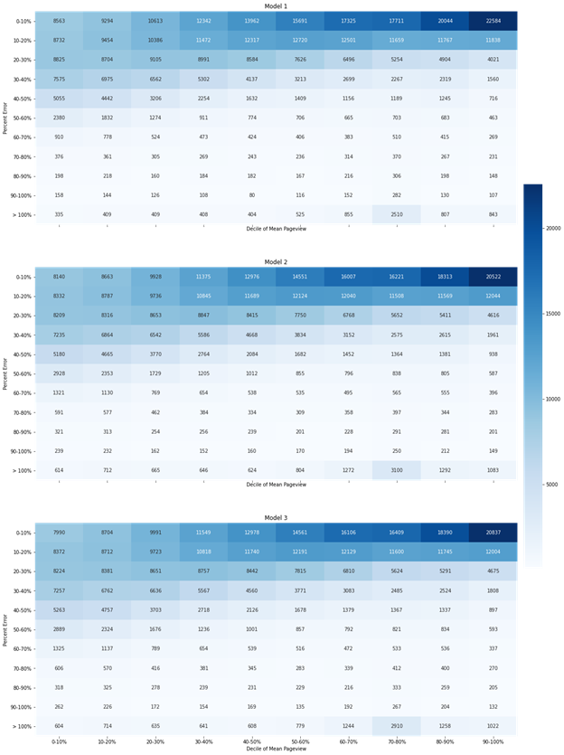

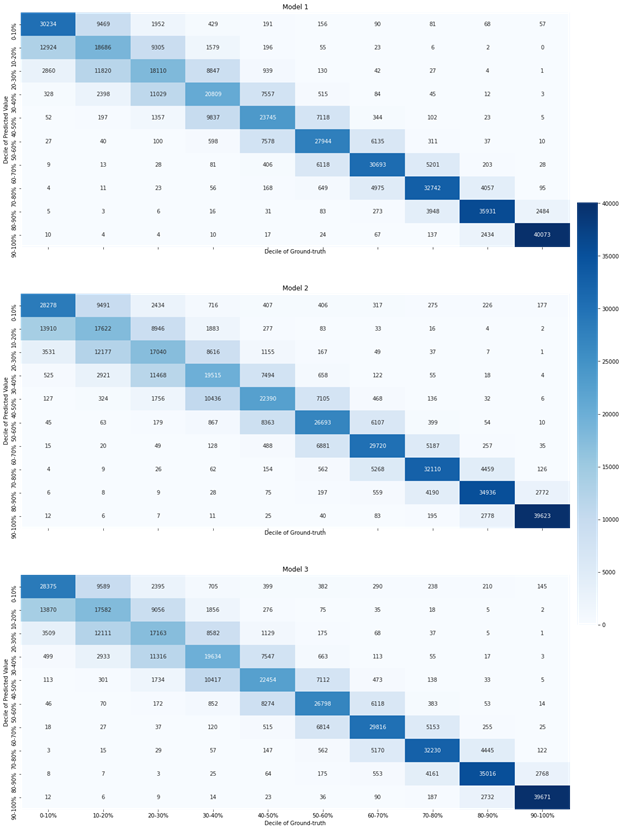

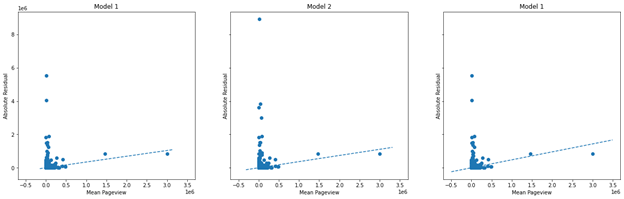

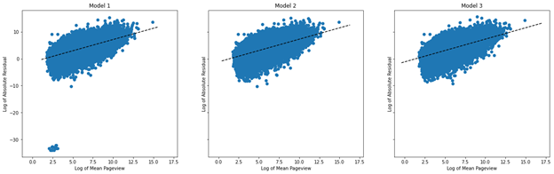

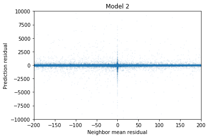

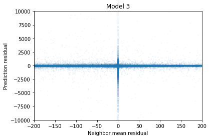

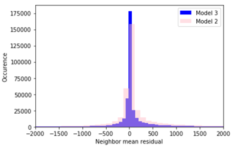

[Back to Homepage](../index.html)
